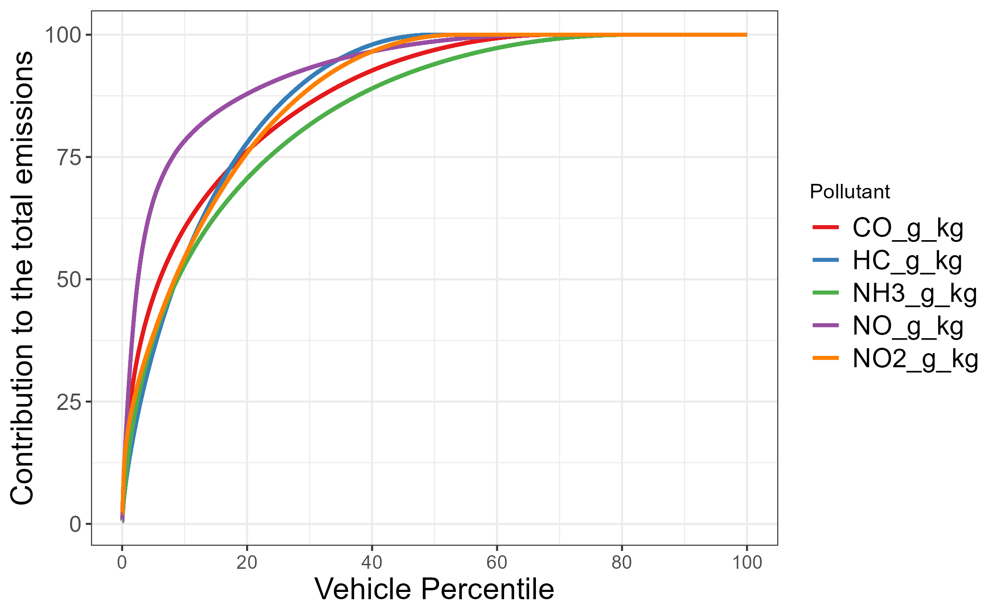

# HW3. Exploratory Data Analysis of Emissions Data

## Instructions

-   Conduct an exploratory data analysis emissions_data.csv" in the hw folder in the public class repository

    -   This is a data set of vehicle emissions data that my students and I collected in Utah County in the summer of 2022 on four separate days.
    -   For each vehicle, we measured emission rates for the following 5 gaseous pollutants - Carbon monoxide (CO) - Bulk hydrocarbons (HC) - which includes many species of gaseous hydrocarbons such as propane - Nitrogen Oxide (NO) - Ammonia (NH3) - Nitrogen dioxides
    -   the emission rates are reported in units gram of pollutant per kilogram of fuel burned

-   I want you to explore the data, and make graphs of the data by looking for patterns as prompted below

-   Conduct your analysis using an Rmarkdown .rmd document

    -   Display all your R code (make sure echo=TRUE)

## Requirements

1.  Read in the file "emissions_data.csv" in the hw folder in the public class repository

2.  Reshape the data to a long format with all the pollutant names in one column, and all the values for the emission rates in another column

3.  Plot all the data.

-   Plot the points with the emission rates on the y axis and the time on the x-axis.
-   Create separate plots for each day and pollutant
    -   You can use faceting or create separate figures by date and/or pollutant
    -   Make sure the data is formatted well, with the scales appropriate to see the data
        -   Hint: If you are faceting, consider using scales='free_y'
-   Questions:
    -   Does there appear to be any systematic drift or trend in the emissions across time?
    -   Are there any periods where we have missing data?

4.  What is the distribution of the emissions data for each pollutant?
    -   Make a histogram for the emission rate for each pollutant
    -   Use facet_grid or facet_wrap to display each pollutant separately
    -   With the scales appropriate to see the data
    -   Adjust the number of bins or the bindwidth or to display the data well v
    -   Choose fill colors to display the data well

-   Questions:
    -   Describe the distribution of the emission rates?
    -   How do the distributions they differ among pollutants?
    -   This is a good resource for describing distributions <https://smogdr.github.io/edar_coursebook/eda1.html#what-to-look-for-in-a-histogram>

5.  Distribution (continued) - Density plots

    -   Make density plot for each of the pollutants
    -   Customize the plot to make it look nice

6.  Distribution (continued) - Box plots

    -   Create box plots with a separate panel for each pollutant, and the date on the x-axis

    Question:

    -   Is the box plot a good plot for comparing the distribution of pollutant between dates?
    -   Why or why not?
    -   There's a good description of the box plots here: <https://smogdr.github.io/edar_coursebook/eda1.html#box>

7.  Create Cumulative Distribution Plots

One of the most important features of our data are the small amount of high emitting vehicles. They are difficult to see in the histogram and density plots. - First calculate a dataframe with the cumulative fraction calculated for each vehicle - Create a new df from emissions.data.long - Filter to one pollutant - Filter out any missing values - Arrange the df from smallest to largest emission rate - Calculate the cumulative fraction of each observation - Look here: <https://smogdr.github.io/edar_coursebook/eda1.html#cumulative-distribution-plot> - Plot a cumulative distribution plot for one of the pollutants - Use geom_point

-   Create a for loop that creates one dataframe called emissions.data.ordered.all that has the cum_pct calculated for each of the pollutants <https://intro2r.com/loops.html>
    -   Now graph the cumulative distribution plot for each pollutant using facets Question:
        -   Which pollutants are the most skewed?
    -   Now repeat the plot from emissions.data.long using stat_ecdf(geom='point')
        -   Did you get the same graph using stat_ecdf as your custom graph above?
        -   Was it easier?

8.  Column Plot - mean of the emission rate by pollutant and date and location.\

-   Calculate the mean emission rate by date, location and pollutant
-   Use group_by and the summarize function to create a new summary dataframe
-   Plot different facets for each pollutant
-   Plot DATE on the x-axis
-   Plot fill color as location

9.  We have just scratched the surface in understanding our dataset. Look into a question that you are curious about the data set. 

-   For example, How do vehicle emissions vary by fuel type, model year, acceleration, speed, or a combination of these factors?
-   Make a graph that addresses your question
-   What did you find?

10. Extra Credit Challenge (+1 pt)

What contribution do the highest emitters contribute to the total emissions?

In this case, set all negative emission rates = 0. Calculate the contribution each vehicle contributes to the total, when ordered from highest emitting to lowest emitting

Plot the results. Can you re-create the following figure?

